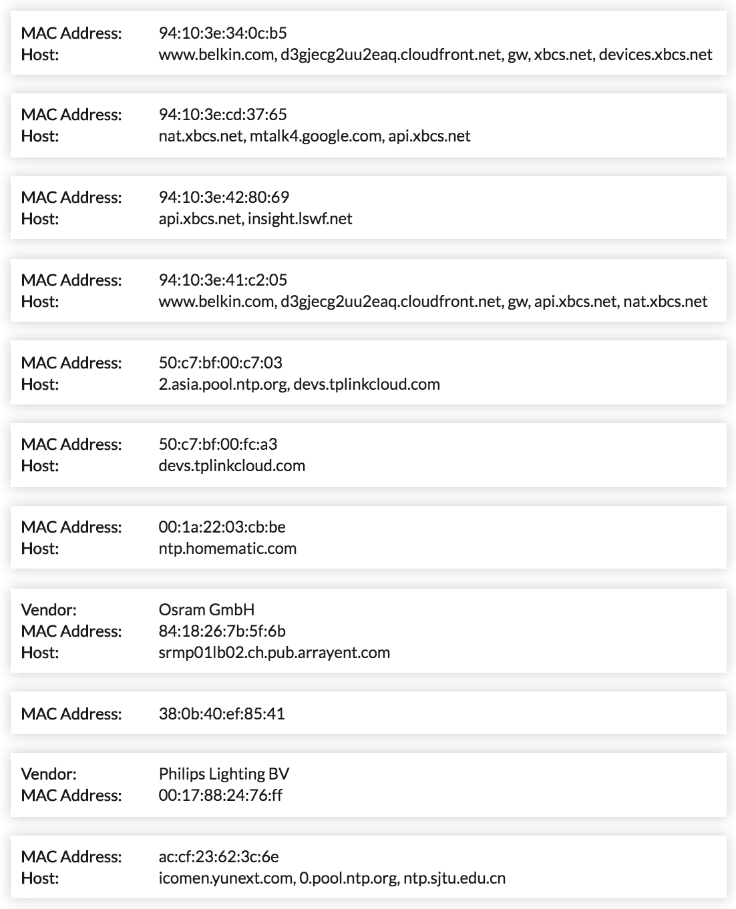
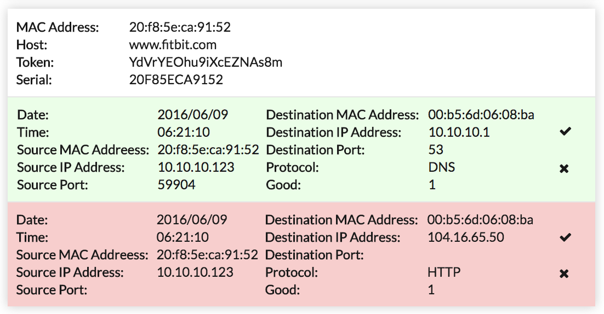

# USC/ISI Graduate Hackathon 2018

## User Interface

### Overview

The web user interface provides a unified front to manage the packets generated by the devices discovered on the network.

### Implementation Details
 
The front-end was implemented with the React javascript framework to handle the generation and display of devices and policies as components. All of the styling was done with SASS modules local to the components. Webpack 3 was used to compile and bundle the generated code. The front-end was connected to the backend via a websocket connection provided by the socket.io library. The backend was written in Node, and used Express to create an API- and web-server, as well as socket.io to create a websocket server.
<br>
### Data Flow

The user interface marks the final step in the data flow process. After the algorithm has determined the policies for all discovered devices on the server, it sends the information to the backend API-server in the form of a POST request. The following packet format is the template to represent a unique device found on the network:
<br>
```javascript
{
  "ff:ff:ff:ff:ff:ff": {
    "org": String(),
    "host": [ String() ],
    "token": [ String() ],
    "model": [ String() ],
    "serialNumber": [ String() ],
    "packets": [
      {
        "id": [ Number() ],
        "date": String(),
        "time": String(),
        "source_ip": String(),
        "source_port": String(),
        "dest_mac": String(),
        "dest_ip": String(),
        "dest_port": String(),
        "protocol": String(),
        "good_packet": Number(),
        "allowed": Number()
      }
    ]
  }
}
```

Each object in the "packets" array acts as a rule for the device. In the interest of not repeating redundant information, the following fields are used to determine the uniqueness of a rule:
<br> 
```javascript
{
  "source_ip": String(),
  "source_port": String(),
  "dest_mac": String(),
  "dest_ip": String(),
  "dest_port": String(),
  "protocol": String(),
}
```
If two packets include the same information in these fields, they will be represented under a single rule, and their id will be preserved in the "id" array.
<br><br>
After the POST request is received by the API-server, it forwards that information to every websocket client connected to the socket.io server.
As that information is received by the browser (client), it generates and displays the results accordingly.
<br>

### Visualization and Interaction

The results are grouped by device to allow the user to easily make policy configuration changes. 



By clicking on a device, the rules pertraining to that device become visible in a dropdown. 



Each rule is shown with either a green or red background originally. Green means that the policy generation algorithm has allowed the packet to pass through, while red means that the policy generation algorithm has blocked the packet. Each rule then can further be modified manually to override the default generated policies.

### Responsive Design

The website works well in both dekstop and mobile web environments. 